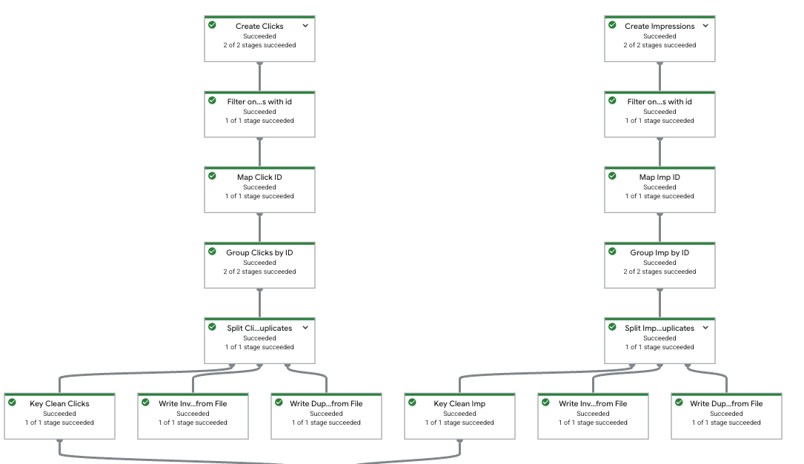
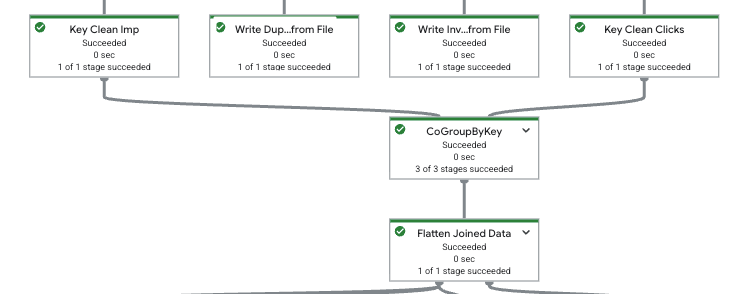
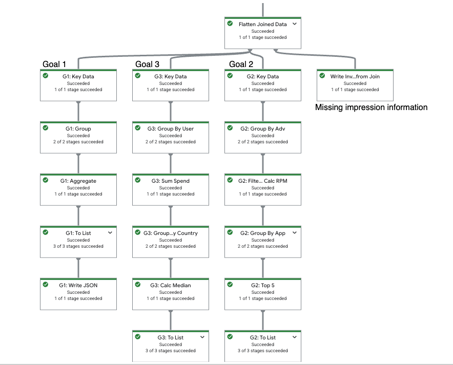

# Simple ETL for Ads events batch processing
This repository contains a ETL job in Apache Beam that will process events saved in two json files. In order to complete the assignment, a few assumptions had to be done and those will be listed below. Furthermore, this is just a simple ETL pipeline, so many steps/corner cases will be mentioned but unfortunately will not be covered at this time.

# Objective of the challenge
The goal is to process two json files that simulate two event data generated by an Ad Server system. 

The file `impressions.json` contains data related to impressions with the following schema:

- `id` (string): a UUID that identifies the impression.
- `user_id` (string): a UUID that identifies the user shown the ad.
- `app_id` (integer): an identifier for the application showing the impression.
- `country_code` (string): a 2-letter country code. It does not necessarily follow a standard such as ISO 3166.
- `advertiser_id` (integer): an identifier of the advertiser that purchased the impression.

The file `clicks.json` contains data related to clicks for an impression (in other words revenue that is generated when a user clicks on an ad):
- `id` (string): a UUID that identifies the click.
- `impression_id` (string): a reference to the UUID of the impression that produced the click.
- `revenue` (floating point): the amount paid by the advertiser when the click is tracked.

From those two input files, the goal is to enable business teams to perform analysis on the data. For example the following three business goals are requested:

## Goals

### 1. Calculate metrics

The business team wants to evaluate performance across a set of dimensions. For example, they would like to assess how applications perform by country. This will help identify new opportunities or underperforming markets.

Metrics:

- Count of impressions
- Count of clicks
- Sum of revenue

Dimensions:

- `app_id`
- `country_code`

Write the output to a JSON file using the following format:

```json
[
  {
    "app_id": 1,
    "country_code": "US",
    "impressions": 102,
    "clicks": 12,
    "revenue": 10.2
  },
  ...
]
```

### 2. Recommend the top 5 `advertiser_id` values for each app and country

The business team also wants to know the strongest advertisers for each application and country. This enables them to focus on the highest-value partners. Performance is measured by the highest `revenue/impressions` rate (average revenue per impression). Only consider advertisers with at least 5 impressions.

Output fields:

- `app_id`
- `country_code`
- `recommended_advertiser_ids` (list of the top 5 advertiser IDs with the highest revenue per impression in that app and country)

Write the output to a JSON file using the following format:

```json
[
  {
    "app_id": 1,
    "country_code": "US",
    "recommended_advertiser_ids": [32, 12, 45, 4, 1]
  },
  ...
]
```

### 3. Median user spend

For each country, determine the median spend per user. Median is needed because outlier users can skew averages.

Write the output to a JSON file using the following format:

```json
[
  {
    "country_code": "US",
    "median_spend": 2.54
  },
  ...
]
```

# Asumptions and considerations:

0. For local execution, it is assumed that the data fits in RAM. However as it will be discussed in the deploy to production section, ideally data should be read or processed in chunks, therefore we should split the input data into chunks that can fit in memory.

1. The data in the json file contains always the key `id`, this may be empty or null but it is always present. In case the id is missing at all (not null but missing as a property from the json object) the click or impression will just be ignored.

2. There may be duplicate data in both files, in this case, the duplicates are dropped (duplicate means that an click id for clicks.json is present multiple times or that a impression id for impression.json is multiple times). For example the from the following click input, only one is considered regardless if impression_id or revenue is different:

    ```json
    {
        "id": "2add46d1-e846-4566-a4f4-4b99f596a75b",
        "impression_id": "974f9aeb-e6cd-4d36-af9c-5e1624efcfb0",
        "revenue": 0.69
    },
    {
        "id": "2add46d1-e846-4566-a4f4-4b99f596a75b",
        "impression_id": "974f9aeb-e6cd-4d36-af9c-5e1624efcfb0",
        "revenue": 0.69
    }
    ```

    duplicate data info is saved into `dlq/duplicate_clicks.json` and `dlq/duplicate_impressions.json`.

3. clicks may relate to impressions that are not present in impressions json. In this case, those are just ignored, since the join between the two data sets is following a LEFT JOIN logic, therefore, there are impressions that may not have generated any click/revenue and there are impression_ids that may not be in impressions (those cases are saved into the file `dlq/invalid_clicks_missing_imp`)

4. In case a id is null or empty, it will go to `dlq/invalid_clicks.json` or `dlq/invalid_impressions.json` for further processing.

5. Invalid country_code are accepted, even though some data may have an incorrect country_code, this may still allow business to perform some analysis on the advertisers or app_ids. Therefore, those events are not skipped and the original country_code is kept (e.g. null, ???, '', etc).

6. The goal 2, requires advertisers to have had at least 5 impressions for the couple app_id & country_code, therefore it is not a global counter but it is a counter for the group app_id and country_code.

7. The excersise specifies the format for the ids, some more checks could be done for the values and label them as invalid but for the simplicty of the execersise, it will be asssumed that if a value string is present, it is valid.

8. If any of the required fields for the analysis is missing, a empty string will be used. For example if a element in impressions doesn't have the property country_code, an empty string will be used.

## How to run

1. create a virtual environment with python 3.11 (other versions may work but not all are compatible with Apache beam 2.69.0)

    ```bash
    python -m venv /path/to/new/virtual/environment

    source /path/to/new/virtual/environment/bin/activate

    pip install -r requirements.txt # make sure that you are in the root directory of the project
    ```
    this may take some time due to apache-beam[gcp]==2.69.0 that is a bit heavy to download.

2. Once the requirements have been installed, simply run the following command
    ```bash
    python main.py --impressions_json_path=input/original_impressions.json --clicks_json_path=input/original_clicks.json
    ```
impressions_json_path and clicks_json_path are optional and if missing they will pick the two files clicks.json and impressions.json from the input directory.

## The pipeline
The pipeline starts with the following logic:
### 1. Read from the json files
This step reads from the input files, selects only the elements that have an id and then deduplicates by groupping by id and picking only the first value. In case there are duplicates those are written to a separate file and in case some have null or '' id (invalid id) those are also redirected to a different place.

```Python
    # Create Impressions PCollection, tag duplicate data and invalid data for further processing and tag clean data for the main pipeline
    impressions_split = (
        pipeline 
        | 'Create Impressions' >> beam.Create(impressions_data)
        | 'Filter only impressions with id' >> beam.Filter(lambda x: 'id' in x)
        | 'Map Imp ID' >> beam.Map(lambda x: (x['id'], x))
        | 'Group Imp by ID' >> beam.GroupByKey()
        | 'Split Imp Duplicates' >> beam.ParDo(DetectAndSplitDuplicatesFn()).with_outputs('duplicates', 'invalid', main='clean')
    )
    
    clean_impressions = impressions_split.clean
    impressions_dups = impressions_split.duplicates
    invalid_impressions = impressions_split.invalid

    # Create Clicks PCollection, tag duplicate data and invalid data for further processing and tag clean data for the main pipeline
    clicks_split = (
        pipeline 
        | 'Create Clicks' >> beam.Create(clicks_data)
        | 'Filter only clicks with id' >> beam.Filter(lambda x: 'id' in x)
        | 'Map Click ID' >> beam.Map(lambda x: (x['id'], x))
        | 'Group Clicks by ID' >> beam.GroupByKey()
        | 'Split Click Duplicates' >> beam.ParDo(DetectAndSplitDuplicatesFn()).with_outputs('duplicates', 'invalid', main='clean')
    )
    
    clean_clicks = clicks_split.clean
    clicks_dups = clicks_split.duplicates
    invalid_clicks = clicks_split.invalid
```



### 2. Join the data based on impression id
Once the data has been read and validated (that impressions id is present). The two dataseats are joined with a CoGroupByKey:

```Python
joined_data = (
                {'impressions': keyed_clean_impressions, 'clicks': keyed_clean_clicks}
                | 'CoGroupByKey' >> beam.CoGroupByKey()
            )
```


Once the data is joined, it can be flatten to extract the insights requested in the Goals. Data was was not found in impressions is saved separately for further processing in case the impressions arrive in a different chunk of data or file.

### 3. Transforms and Aggregations

For each goal, the a branch was created in the Execution graph.


#### Goal 1
Data is grouped by app_id and country_code. The measures are summed up (impressions count, clicks count, sum of revenue). No filter is applied as it was nore quested.

#### Goal 2
For each app_id and country_code, the top 5 advertisers (that have been present in at least 5 impressions for that particular combination of app_id and country_code).

The idea here is to group by app_id, country_code, adverstirers and then calculate the impressions for those advertisers. If the count is >=5 then the advertisers are considered valid and the top 5 (based on revenue/impression rate is taken)


#### Goal 3
For each country, median user spend. In order to calculate the median, a group by country and user is performed, then from the list of spend/revenue of each country, user combination the median value is taken.


# Deploy to production

## Ingestion and data reliability

This particular job is written in Apache Beam, Apache Beam is a programming model that unifies the logic for streaming and batch processing. Therefore, in case we would like to start ingesting real time data, the code will not change very much but only the input/ingestion step will be different.

In a real world scenario, this particular data is generated by devices and users whenever a click event happens. Therefore, data is likely going to be real time streams, for that reason the pipeline needs be robust and the system should be reliable without any dataloss. For example in case the job fails, data should not be lost but saved into something called Dead Letter Queue where we store events that were not successfully processed. Furthermore, it may also be a case that we need to reprocess data from the origin, but that data may not be replicable because those are real time events done by the users. Therefore it is also a good practice to introduce a event streaming system that focus on fault tolerance, low latency reads, concurrent reads and that enables easily the reprocessing.

One of the most common systems to store real time event streaming data is Apache Kafka, Apache Kafka brings stability to where we store the data that came from the devices and allows parallel reads for our jobs and a fault tolerant source that will be reliable for the jobs in case of reprocessing. So every time events are generated those will published into topics in Kafka, and afterwards those will be consumed by our ETL jobs. Reprocessing is quick since Kafka works with a concept called 'offset', it means that each consumer of data will know the latest data it has consumed and the brokers will know the latest available offset for the data.

## Processing and scalability
Apache Beam is a programming model that separates the concept of infrastructure and coding. Being a programming model means that the code is written without taking into account where it will run, this means that the infrastructure that will run the job is not important as long as it supports the beam SDK. For example the code could run in Google Dataflow (serverless runner for Apache Beam from Google), Apache Spark cluster, Apache Flink cluster or even locally. Apache Beam unifies batch and streaming processing into a single programming model, and in case we would like to deploy the job to production to process real time data, we would need to adjust the input to be a stream coming from Kafka or similar.

In case the amount of data increases significally that it is not feasible to run anymore the code locally, the code can easily be deployed by chaning the runner from DirectRunner to DataflowRunner for example:

```python
runner = "DataflowRunner"
pipeline_options = PipelineOptions(
    runner=runner,
    project='mygcpproject',
    setup_file='./setup.py',
    region='us-east4'
)
```
Dataflow is a serverless runner fully managed by GCP, it comes with two main features that allow to process data cheaper and quicker. Shuffle service for batch processing and Streaming Enginer for streaming jobs, the idea behind those two features is that the shuffle operation does not occur in the worker Virtual Machines but it occurs in the backend (Google takes care of the shuffle operation and then returns the data shuffled).

Furthermore, Dataflow is fully managed, in the sense that it will find the right parameters to split the data into chunks if needed, increase or reduce the number of workers if needed and provides also insights about the throughput and latency of each step.

So scalablity of the processing, can easily be managed by Dataflow since the distributed processing is managed by Google in a serverless manner. However, in a real world scenario, errors happens and sometimes data may contain errors that were not expected/covered by the code. In those cases, it is a good practice to have a Deal Letter Queue, ideally every step in the code should keep in mid that there may be errors/exceptions, therefore every step should redirect that elements that were not processed into a different place for further anaylsis/processing. For example in the case that country code is invalid, that element should be labeled as invalid_country so that it can be later processed.
